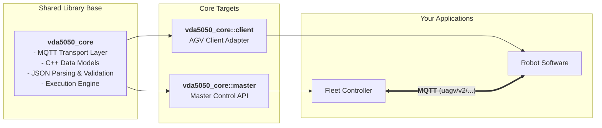

# VDA5050 Library and Support Tools

`vda5050_core` is a modern C++ library designed for implementing the [VDA5050 specification](https://github.com/VDA5050/VDA5050) across AGVs, AMRs and fleet control systems.

It provides native JSON serialization/deserialization, specification validation, an asynchronous execution framework, MQTT transport abstractions and high-level client adapter
and master control APIs.

The library is **framework-independent** and can be embedded directly into standalone native C++ drivers, ROS 2 packages, or Python-based systems.



> [!NOTE]
> This project is under active development. API stability is guaranteed across minor releases.


## Features

- **Specification Compliant Data Structures:** Native C++17 representations for all VDA5050 message types.
- **Serialization and Validation:** Fast JSON parsing (`nlohmann/json`) with standard compliance validation
- **Asynchronous Execution Framework:** Reactive execution engine for managing non-blocking robot state transitions, node execution and instant actions.
- **High-Level Client Adapter API:** Pre-built abstraction layer wrapping navigation, action execution and automated state reporting.
- **Layout Interchange Format (LIF):** Native support for loading and validating VDMA define Layout Interchange Format.
- **Multi-Ecosystem Support:** Standalone CMake and `ament_cmake` build integration, optional ROS 2 (`vda5050_interfaces`) support and Python bindings via `pybind11`.

## Overview

| Guide                                                              | Description                                               |
| ------------------------------------------------------------------ | --------------------------------------------------------- |
| **[Client Adapter Guide](vda5050_core/docs/client-adapter.md)**    | Step-by-step integration guide for AGV/AMR                |
| **[Types and Serialization Guide](vda5050_core/docs/types.md)**    | Message structures, validation rules and JSON conversion  |
| **[Open-RMF Migration Guide](vda5050_core/docs/rmf-migration.md)** | Migrating an Open-RMF fleet adapter to a VDA5050 Adapter  |
| **[Architecture and Design](vda5050_core/docs/design.md)**         | Architecture and design rationale                         |

To connect an existing robot SDK, REST API or ROS 2 navigation system, start with the [Client Adapter Guide](vda5050_core/docs/client-adapter.md).

## Getting Started

### Requirements

- **C++ Compiler:** C++17 or higher
- **Build System:** CMake $\ge 3.8$, `colcon` (optional for ROS 2 workspaces)
- **System Libraries:** `nlohmann-json3-dev`, `libfmt-dev`, `libpaho-mqtt-dev`, `libpaho-mqttpp-dev`
- **Optional:** ROS 2 (Humble/Jazzy) for `vda5050_interfaces`, `pybind11` for Python bindings.

### Build

1. Install the required MQTT dependencies:

```bash
sudo apt update
sudo apt install libpaho-mqtt-dev libpaho-mqttpp-dev
```

2. Create a workspace, clone the repository and build the package:

```bash
mkdir -p ~/vda5050_ws/src
cd ~/vda5050_ws/src

git clone https://github.com/ros-industrial/vda5050_core.git

cd ~/vda5050_ws
colcon build --packages-select vda5050_core
source install/setup.bash
```

#### Build Options

Pass these flags through `colcon build --cmake-args -D<OPTION>=<VALUE>` or directly in CMake.

| Option           | Default | Effect                                                  |
| ---------------- | ------- | ------------------------------------------------------- |
| `ENABLE_ROS2`    | `OFF`   | Enables support for ROS 2 `vda5050_interfaces` messages |
| `BUILD_PYTHON`   | `ON`    | Builds the Python bindings                              |
| `BUILD_EXAMPLES` | `ON`    | Builds the examples                                     |
| `BUILD_TESTING`  | `ON`    | Builds the tests and configured linters                 |

### Quick Examples

#### AGV Client Integration

The following example shows the basic setup for an AGV-side client.

It creates an MQTT transport and a VDA5050 client adapter, then registers a navigation callback.
In a real application, the callback should forward the request to the robot's navigation system.

```cpp
#include <iostream>

#include "vda5050_core/client/adapter/adapter.hpp"
#include "vda5050_core/execution/protocol_adapter.hpp"
#include "vda5050_core/transport/mqtt_client_interface.hpp"

using namespace vda5050_core;

int main()
{
  auto mqtt_client = transport::create_default_client_unique(
    "tcp://localhost:1883",
    "agv_1");

  auto protocol_adapter = execution::ProtocolAdapter::make(
    std::move(mqtt_client),
    "uagv",
    "2.0.0",
    "Manufacturer",
    "S001");

  auto adapter = client::adapter::Adapter::make(protocol_adapter);

  adapter->on_navigate(
    [](auto node_request, auto edge_request, auto execution)
    {
      // Forward the request to the robot navigation system.
      //
      // This demonstration reports completion immediately.
      // A real integration should only report completion after
      // the robot reaches the requested node.
      execution->finished();
    });

  adapter->start();

  // Keep processing orders until Enter is pressed.
  std::cin.get();

  adapter->stop();
  return 0;
}
```

##### Linking with CMake

```cmake
find_package(vda5050_core REQUIRED)

target_link_libraries(agv_application
  PRIVATE
    vda5050_core::client
)
```

For a complete integration covering navigation, actions, localization, cancellation and state reporting,
see the [Client Adapter Guide](vda5050_core/docs/client-adapter.md) and a preconfigured
[example](vda5050_core/examples/client/adapter_example.cpp).

## Examples

You can launch a local MQTT broker to test the included examples.

```bash
mosquitto -v -p 1883
```

| Example                                                   | Demonstrates                                     |
| --------------------------------------------------------- | ------------------------------------------------ |
| `vda5050_core/examples/client/adapter_example.cpp`        | AGV client-adapter integration                   |
| `vda5050_core/examples/master/order_publisher.cpp`        | Continuously dispatching a growing VDA5050 order |

## Directory Layout

```bash
.
└── vda5050_core
    ├── docs                 # Guides and architectural documentation
    ├── examples             # Ready-to-run executables
    ├── include
    │   └── vda5050_core
    │       ├── client       # High-level AGV client adapter
    │       ├── errors       # Error definitions
    │       ├── execution    # Reactive execution framework
    │       ├── json_utils   # JSON serialization and traits
    │       ├── layout       # Layout Interchange Format (LIF) support and tools
    │       ├── logger       # Logging utilities
    │       ├── master       # Master control components
    │       ├── transport    # MQTT client interface and default implementation
    │       ├── types        # VDA5050 message structs
    │       └── validation   # VDA5050 specification compliance checks
    ├── python               # pybind11 modules and migration tools
    └── test                 # Unit and integration tests
```

## Testing

Run the unit and integration tests using `colcon`.

```bash
colcon test --event-handlers console_direct+ --packages-select vda5050_core
```

> Note: Some integration tests require an active MQTT broker listening on `localhost:1883`.

## Contributing

Contributions are welcome!

See [CONTRIBUTING.md](CONTRIBUTING.md) for development and contribution guidelines.

Commits must include a `Signed-off-by` line certifying the [Developer Certificate of Origin](https://developercertificate.org/).

## License

Licensed under the Apache License 2.0. See [LICENSE](LICENSE) for details.
