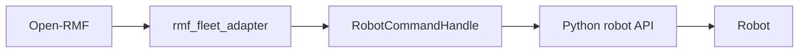
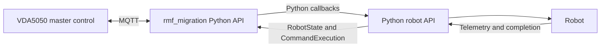

# Migrating an Open-RMF Robot Integration using Python Bindings

This guide explains how to adapt the provided Python VDA5050 fleet adapter example for a real robot. 

The example reuses an existing robot-specific Python interface while replacing the Open-RMF fleet-adapter layer with the VDA5050 client adapter provided by `vda5050_core_python`.

Developers can generally:

- keep the generic adapter logic in `fleet_adapter.py`
- update the fleet, MQTT and robot information in `config.yaml`
- replace the print-only methods in `RobotClientAPI.py` with calls to the real robot API, SDK or ROS 2 interface.


## Table of Contents

1. [Scope](#1-scope)
2. [Architecture Change](#2-architecture-change)
3. [Example Files](#3-example-files)
4. [Configure the Fleet and Robot](#4-configure-the-fleet-and-robot)  
  4.1 [Fleet settings](#41-fleet-settings)  
  4.2 [Robot identity](#42-robot-identity)  
  4.3 [Initial robot state](#43-initial-robot-state)  
  4.4 [MQTT connection](#44-mqtt-connection)  
  4.5 [Print-only settings](#45-print-only-settings)
5. [How](#5-how-fleet_adapterpy-works) `fleet_adapter.py` [Works](#5-how-fleet_adapterpy-works)
6. [Create the Adapter and Fleet](#6-create-the-adapter-and-fleet)
7. [Configure and Register a Robot](#7-configure-and-register-a-robot)
8. [Register Robot Callbacks](#8-register-robot-callbacks)
9. [Connect a Real Robot Through](#9-connect-a-real-robot-through-robotclientapipy) `RobotClientAPI.py`
10. [Configure the Robot API Client](#10-configure-the-robot-api-client)
11. [Check the Robot Connection](#11-check-the-robot-connection)
12. [Handle Localization](#12-handle-localization)
13. [Handle Navigation Requests](#13-handle-navigation-requests)
14. [Report Navigation Completion](#14-report-navigation-completion)
15. [Handle Robot Actions](#15-handle-robot-actions)
16. [Handle Stop Requests](#16-handle-stop-requests)
17. [Read Robot Telemetry](#17-read-robot-telemetry)
18. [Return the Robot Position](#18-return-the-robot-position)
19. [Return the Battery State](#19-return-the-battery-state)
20. [Return the Current Map](#20-return-the-current-map)
21. [Build](#21-build-robotupdatedata) `RobotUpdateData`
22. [Publish Robot State and Driving Status](#22-publish-robot-state-and-driving-status)
23. [Coordinate Frames](#23-coordinate-frames)
24. [Thread Safety](#24-thread-safety)
25. [Start and Stop the Adapter](#25-start-and-stop-the-adapter)
26. [Example Real-Robot Migration](#26-example-real-robot-migration)
27. [Build the Python Bindings and Example](#27-build-the-python-bindings-and-example)
28. [Run the Example](#28-run-the-example)
29. [Test the Migration](#29-test-the-migration)
30. [Migration Summary](#30-migration-summary)
31. [Experimental Limitations](#31-experimental-limitations)


## 1. Scope

After migration, the robot integration can:

- receive VDA5050 orders and instant actions over MQTT
- forward navigation and action requests to an existing Python robot API
- report navigation or action success and failure
- update AGV state
- communicate with a VDA5050 master control

The VDA5050 client adapter replaces the robot-facing fleet adapter layer only. It does not replace all Open-RMF functions. The following must come from the VDA5050 master control or another external system:

- traffic scheduling
- traffic negotiation
- task allocation
- door and lift coordination
- charging workflows
- fleet-level planning


## 2. Architecture Change

A typical Open-RMF integration is structured as:




After migration:




Your robot driver, vendor SDK, REST/gRPC client, telemetry polling, and completion detection can usually remain unchanged. Only the layer that dispatches commands and publishes state changes.

## 3. Example Files

The complete Python fleet adapter example is located under:

```
examples/python/fleet_adapter/
```

It contains:

```
fleet_adapter.py
RobotClientAPI.py
config.yaml
README.md
```

Each file has a different responsibility.


| File                | Purpose                                                              | Expected changes                      |
| ------------------- | -------------------------------------------------------------------- | ------------------------------------- |
| `fleet_adapter.py`  | Connects VDA5050 callbacks and state updates to the robot API        | Usually kept unchanged                |
| `RobotClientAPI.py` | Provides robot-specific commands, telemetry, and completion checks   | Replace the print-only implementation |
| `config.yaml`       | Configures the fleet, MQTT broker, robot identity, and initial state | Replace with deployment values        |


The main migration work should be performed in `RobotClientAPI.py`, not by rewriting the VDA5050 adapter.

## 4. Configure the Fleet and Robot

The example uses the following YAML structure:

```
rmf_fleet:
  name: "demo_fleet"
  update_rate_hz: 5.0
  robot_state_update_interval: 30

  robots:
    robot_1:
      manufacturer: "Manufacturer"
      serial_number: "S001"
      interface_name: "uagv"
      version: "2.0.0"
      battery_soc: 1.0
      travel_time: 2.0

      start:
        map_name: "map_1"
        x: 0.0
        y: 0.0
        theta: 0.0

fleet_manager:
  broker_uri: "tcp://localhost:1883"
  client_id_prefix: "demo_fleet_adapter"
```


### 4.1 Fleet settings

```
rmf_fleet:
  name: "demo_fleet"
  update_rate_hz: 5.0
  robot_state_update_interval: 30
```

- `name` is the fleet name used by the adapter.
- `update_rate_hz` controls how often the adapter reads robot data and checks command completion.
- `robot_state_update_interval` is the maximum VDA5050 state heartbeat interval in seconds.

For example, an update rate of `5.0` means the adapter checks robot state approximately five times per second.

### 4.2 Robot identity

```
robots:
  robot_1:
    manufacturer: "Manufacturer"
    serial_number: "S001"
    interface_name: "uagv"
    version: "2.0.0"
```

- `robot_1` is the local name used by the Python adapter.
- `manufacturer` is the VDA5050 manufacturer identity.
- `serial_number` uniquely identifies the robot.
- `interface_name` is normally `uagv`.
- `version` is the VDA5050 protocol version used in the MQTT topic.

These values form topics such as:

```
uagv/v2/Manufacturer/S001/order
uagv/v2/Manufacturer/S001/instantActions
uagv/v2/Manufacturer/S001/state
uagv/v2/Manufacturer/S001/connection
```

The manufacturer and serial number must match the values used by the VDA5050 master control.

### 4.3 Initial robot state

```
start:
  map_name: "map_1"
  x: 0.0
  y: 0.0
  theta: 0.0
```

This defines the robot state used when it is first registered.

The map name and coordinate frame must match the map used by the VDA5050 master control.

### 4.4 MQTT connection

```
fleet_manager:
  broker_uri: "tcp://localhost:1883"
  client_id_prefix: "demo_fleet_adapter"
```

- `broker_uri` is the VDA5050 MQTT broker address.
- `client_id_prefix` is used to generate MQTT client IDs.

MQTT client IDs must be unique. Use a different prefix when running multiple adapters against the same broker.

### 4.5 Print-only settings

The following settings are used only by the simulated robot:

```
battery_soc: 1.0
travel_time: 2.0
```

- `battery_soc` provides an initial simulated battery level.
- `travel_time` controls the simulated delay before a navigation command is considered complete.

`travel_time` should normally be removed when connecting a real robot.

The real battery value should be retrieved from robot telemetry.

## 5. How `fleet_adapter.py` Works

`fleet_adapter.py` contains the generic VDA5050 integration logic.

It:

1. loads the YAML configuration;
2. creates the VDA5050 adapter;
3. creates the fleet;
4. registers robots;
5. registers command callbacks;
6. forwards commands to `RobotAPI`;
7. reads robot telemetry;
8. reports command completion;
9. publishes robot state;
10. starts and stops the adapter.

Most robot-specific integrations should not need to modify this structure.

## 6. Create the Adapter and Fleet

The migration API is imported through the Python bindings:

```
import vda5050_core_python as vda

rmf = vda.rmf_migration
```

Create the adapter:

```
adapter = rmf.Adapter.make()
```

Create the fleet configuration using positional arguments:

```
fleet_config = rmf.FleetConfiguration(
    fleet_name,
    broker_uri,
    client_id_prefix,
    update_interval,
)
```

In the example, these values are loaded from YAML:

```
fleet_config = rmf.FleetConfiguration(
    fleet_cfg["name"],
    conn["broker_uri"],
    conn["client_id_prefix"],
    int(fleet_cfg.get("robot_state_update_interval", 30)),
)
```

Add the VDA5050 fleet:

```
fleet_handle = adapter.add_vda5050_fleet(fleet_config)
```

The returned `FleetUpdateHandle` is used to register robots.

## 7. Configure and Register a Robot

Create the initial robot state:

```
initial_state = rmf.RobotState(
    start["map_name"],
    [
        float(start["x"]),
        float(start["y"]),
        float(start["theta"]),
    ],
    float(robot_config.get("battery_soc", 1.0)),
)
```

`RobotState` contains:

1. map name;
2. pose as `[x, y, theta]`;
3. battery state of charge from `0.0` to `1.0`.

Create the robot identity:

```
robot_config = rmf.RobotConfiguration(
    manufacturer,
    serial_number,
    interface_name,
    version,
)
```

For example:

```
robot_config = rmf.RobotConfiguration(
    rcfg["manufacturer"],
    rcfg["serial_number"],
    rcfg.get("interface_name", "uagv"),
    rcfg.get("version", "2.0.0"),
)
```

Register the robot:

```
robot_handle = fleet_handle.add_robot(
    robot_name,
    initial_state,
    robot_config,
    callbacks,
)
```

The arguments must be passed positionally.

The returned `RobotUpdateHandle` is used to publish state and driving information.

## 8. Register Robot Callbacks

The example creates the required callbacks as follows:

```
callbacks = rmf.RobotCallbacks(
    self.navigate,
    self.stop,
    self.execute_action,
)

callbacks.localize = self.localize
```

The required callbacks are:

- navigation;
- stop;
- action execution.

Localization is optional and is assigned after constructing `RobotCallbacks`.

These callbacks translate requests from the VDA5050 adapter into calls to `RobotClientAPI.py`.

## 9. Connect a Real Robot Through `RobotClientAPI.py`

`RobotClientAPI.py` contains a print-only robot implementation.

It currently:

- stores the robot pose in memory;
- stores a simulated battery value;
- prints navigation, localization, stop, and action requests;
- uses a timer to simulate navigation;
- reports completion without requiring hardware or a simulator.

To connect a real robot, replace the simulated code with calls to the robot's:

- REST API;
- vendor Python SDK;
- ROS 2 topics;
- ROS 2 services;
- ROS 2 actions;
- gRPC interface;
- TCP interface;
- fleet manager API.

The public method signatures should remain compatible with `fleet_adapter.py`.

## 10. Configure the Robot API Client

The constructor currently initializes the simulated robot state:

```
def __init__(self, config_yaml):
    self.config_yaml = config_yaml
    self.timeout = 5.0
    self.debug = False
```

A real implementation can initialize a vendor client, HTTP session, ROS 2 node, or other connection.

For example:

```
def __init__(self, config_yaml):
    self.config_yaml = config_yaml
    self.timeout = 5.0

    robot_api_config = config_yaml["robot_api"]
    self.base_url = robot_api_config["base_url"]
    self.auth_token = robot_api_config["auth_token"]

    self.client = VendorRobotClient(
        base_url=self.base_url,
        auth_token=self.auth_token,
        timeout=self.timeout,
    )
```

The exact implementation depends on the robot interface.

## 11. Check the Robot Connection

Implement:

```
def check_connection(self) -> bool:
    """Return True if communication with the robot is available."""
```

The print-only example always returns `True`.

A real implementation should perform a health check or verify that the robot interface is reachable.

Example:

```
def check_connection(self) -> bool:
    try:
        return self.client.is_connected()
    except Exception:
        return False
```

The method should return:

- `True` when communication is available;
- `False` when the robot or fleet manager cannot be reached.


## 12. Handle Localization

The fleet adapter forwards an `initPosition` request through:

```
def localize(self, destination, execution):
    if self.api.localize(
        self.name,
        destination.position,
        destination.map,
    ):
        execution.finished()
    else:
        execution.failed("Robot rejected the localization request")
```

Implement the following method in `RobotClientAPI.py`:

```
def localize(
    self,
    robot_name: str,
    pose,
    map_name: str,
) -> bool:
```

The method receives:

- `robot_name`: local robot name;
- `pose`: `[x, y, theta]`;
- `map_name`: requested map ID.

A real implementation should send the initial pose to the robot localization system.

Example:

```
def localize(self, robot_name, pose, map_name) -> bool:
    x, y, theta = pose

    return self.client.set_initial_pose(
        robot_name=robot_name,
        map_name=map_name,
        x=x,
        y=y,
        theta=theta,
    )
```

Return `True` only when the robot accepts the localization request.

When the method returns `False`, the adapter calls:

```
execution.failed("Robot rejected the localization request")
```

The localization callback may be omitted when the robot performs localization independently and does not support external initial-pose requests.

## 13. Handle Navigation Requests

The navigation callback receives:

- a `Destination`;
- a `CommandExecution` handle.

The working adapter uses:

```
def navigate(self, destination, execution):
    with self._lock:
        self.execution = execution

    x, y = destination.xy

    self.api.navigate(
        self.name,
        [x, y, destination.yaw],
        destination.map,
    )
```

The destination provides:

- `destination.xy`: target `x` and `y`;
- `destination.yaw`: target orientation;
- `destination.position`: complete `[x, y, yaw]` pose;
- `destination.map`: destination map ID.

The execution handle is stored until the robot reaches the destination.

### 13.1 Implement the robot navigation command

Implement:

```
def navigate(
    self,
    robot_name: str,
    pose,
    map_name: str,
    speed_limit=0.0,
) -> bool:
```

The method receives:

- robot name;
- target pose `[x, y, theta]`;
- target map name;
- optional speed limit.

Example:

```
def navigate(
    self,
    robot_name,
    pose,
    map_name,
    speed_limit=0.0,
) -> bool:
    x, y, theta = pose

    return self.client.send_navigation_goal(
        robot_name=robot_name,
        map_name=map_name,
        x=x,
        y=y,
        theta=theta,
        speed_limit=speed_limit,
    )
```

`navigate()` should normally submit the command and return without waiting for the robot to arrive.

Do not block the callback for the full duration of robot movement.

Navigation completion is reported asynchronously through `is_command_completed()`.

## 14. Report Navigation Completion

The adapter stores the `CommandExecution` handle when navigation starts:

```
self.execution = execution
```

During each update cycle, it checks:

```
if self.api.is_command_completed(self.name):
    completed_execution = execution
    self.execution = None
```

After leaving the lock, it reports completion:

```
if completed_execution is not None:
    completed_execution.finished()
```

Implement:

```
def is_command_completed(self, robot_name: str) -> bool:
```

A real implementation should check the robot's navigation status.

Example:

```
def is_command_completed(self, robot_name: str) -> bool:
    status = self.client.get_navigation_status(robot_name)
    return status == "COMPLETED"
```

Return `True` only when the robot has physically completed the current navigation command.

Do not return `True` immediately after the robot accepts the command.

### Current limitation

The example returns only `True` or `False`. It does not distinguish between:

- command still running;
- command completed;
- command failed.

A production integration may need separate completion and failure reporting so that it can call:

```
execution.finished()
```

or:

```
execution.failed("Navigation failed")
```

as appropriate.

## 15. Handle Robot Actions

The action callback in the working example is:

```
def execute_action(
    self,
    action_type,
    action_id,
    execution,
):
    self.api.start_activity(
        self.name,
        action_type,
        action_id,
    )

    execution.finished()
```

The callback receives:

- `action_type`: robot action category;
- `action_id`: VDA5050 action identifier;
- `execution`: command execution handle.

Implement:

```
def start_activity(
    self,
    robot_name: str,
    activity: str,
    label: str,
) -> bool:
```

Example robot actions may include:

- `pick`;
- `drop`;
- `dock`;
- `charge`;
- `wait`;
- operating a robot attachment.

Example:

```
def start_activity(
    self,
    robot_name,
    activity,
    label,
) -> bool:
    return self.client.execute_action(
        robot_name=robot_name,
        action_type=activity,
        action_id=label,
    )
```


### Current action limitation

The example calls:

```
execution.finished()
```

immediately after forwarding the action.

This is suitable only when:

- the action completes immediately;
- accepting the request is considered completion;
- the adapter is being used as a simple demonstration.

For a long-running action, such as picking a pallet, store the action execution handle and report completion only when the robot confirms that the action has finished.

For example:

```
def execute_action(self, action_type, action_id, execution):
    accepted = self.api.start_activity(
        self.name,
        action_type,
        action_id,
    )

    if not accepted:
        execution.failed(f"Robot rejected action: {action_type}")
        return

    with self._lock:
        self.action_execution = execution
```

The update loop would then check action completion before calling `finished()`.

## 16. Handle Stop Requests

The callback is defined as:

```
def stop(self):
    self.api.stop(self.name)

    with self._lock:
        self.execution = None
```

Implement:

```
def stop(self, robot_name: str) -> bool:
```

Example:

```
def stop(self, robot_name: str) -> bool:
    return self.client.stop_robot(robot_name)
```


### Current stop limitation

The current VDA5050 core does not invoke this callback during normal operation.

The method is included so the integration can support stop or cancellation when that flow is connected through the core.

Do not depend on this callback as an emergency-stop mechanism.

Safety-critical stopping must be handled by the robot's own safety system.

## 17. Read Robot Telemetry

The adapter periodically calls:

```
data = robot.api.get_data(robot.name)
```

It then constructs a VDA5050 robot state:

```
state = rmf.RobotState(
    data.map_name,
    data.position,
    data.battery_soc,
)
```

A real robot integration must provide:

- current map name;
- current pose `[x, y, theta]`;
- battery state of charge.


## 18. Return the Robot Position

Implement:

```
def position(self, robot_name: str) -> list[float]:
```

Return:

```
[x, y, theta]
```

Example:

```
def position(self, robot_name: str) -> list[float]:
    status = self.client.get_robot_status(robot_name)

    return [
        status.x,
        status.y,
        status.theta,
    ]
```

The position must be expressed in the same coordinate system expected by the VDA5050 master.

## 19. Return the Battery State

Implement:

```
def battery_soc(self, robot_name: str) -> float:
```

Return a value between:

```
0.0 and 1.0
```

For example:

```
def battery_soc(self, robot_name: str) -> float:
    status = self.client.get_robot_status(robot_name)
    return status.battery_percentage / 100.0
```

A robot battery value of `82%` should be returned as:

```
0.82
```


## 20. Return the Current Map

Implement:

```
def get_map_name(self, robot_name: str) -> str:
```

Example:

```
def get_map_name(self, robot_name: str) -> str:
    status = self.client.get_robot_status(robot_name)
    return status.map_name
```

The returned map name must match the `mapId` used by the VDA5050 master control.

## 21. Build `RobotUpdateData`

The example combines the robot telemetry into:

```
class RobotUpdateData:
    def __init__(
        self,
        robot_name: str,
        map_name: str,
        position: list[float],
        battery_soc: float,
    ):
        self.robot_name = robot_name
        self.position = position
        self.map_name = map_name
        self.battery_soc = battery_soc
```

Implement:

```
def get_data(self, robot_name: str):
```

Example:

```
def get_data(self, robot_name: str):
    status = self.client.get_robot_status(robot_name)

    if status is None:
        return None

    return RobotUpdateData(
        robot_name=robot_name,
        map_name=status.map_name,
        position=[
            status.x,
            status.y,
            status.theta,
        ],
        battery_soc=status.battery_percentage / 100.0,
    )
```

Return `None` when valid telemetry is temporarily unavailable.

The adapter skips the update when `None` is returned.

## 22. Publish Robot State and Driving Status

The update loop creates a `RobotState`:

```
state = rmf.RobotState(
    data.map_name,
    data.position,
    data.battery_soc,
)
```

The robot adapter then creates an empty activity identifier:

```
identifier = rmf.ActivityIdentifier()
```

When a command is active, it uses the current execution identifier:

```
identifier = execution.identifier
driving = True
```

The state is published using:

```
self.robot_handle.update(state, identifier)
```

Driving status is reported using:

```
self.robot_handle.more().set_driving(driving)
```

The activity identifier associates the reported state with the current command.

Do not replace this with only:

```
robot_handle.update(state)
```

The working example provides both the state and activity identifier.

## 23. Coordinate Frames

The robot coordinate frame and VDA5050 map coordinate frame must agree.

Confirm that both systems use consistent:

- map IDs;
- x coordinates;
- y coordinates;
- orientation conventions;
- distance units;
- angle units.

For example, confirm whether:

- distance is measured in metres;
- angles are measured in radians;
- positive rotation is clockwise or counter-clockwise;
- the origin is located at the same point;
- the same map name is used by the robot and master control.

If the robot uses a different coordinate frame, convert coordinates at the `RobotClientAPI` boundary.

Before sending a command to the robot:

```
def to_robot_frame(x, y, theta):
    return (
        (x - OFFSET_X) / SCALE,
        (y - OFFSET_Y) / SCALE,
        theta - ROTATION,
    )
```

Before reporting robot telemetry to VDA5050:

```
def to_vda5050_frame(x, y, theta):
    return (
        x * SCALE + OFFSET_X,
        y * SCALE + OFFSET_Y,
        theta + ROTATION,
    )
```

Keep transformations in one place to prevent navigation commands and reported states from using different coordinate systems.

## 24. Thread Safety

Callbacks may be invoked from C++ worker threads while the Python update loop runs separately.

The example protects shared command state using:

```
self._lock = threading.Lock()
```

For example:

```
with self._lock:
    self.execution = execution
```

The update loop also uses the same lock when checking or clearing the execution handle.

Use locking when sharing:

- active execution handles;
- command status;
- cached telemetry;
- action state;
- connection state.

Avoid holding the lock while performing a slow REST request or waiting for a robot response.

## 25. Start and Stop the Adapter

Register all fleets, robots, and callbacks before starting the adapter.

Start it with:

```
adapter.start()
```

The example starts a separate update thread:

```
updater = threading.Thread(
    target=update_loop,
    daemon=True,
)

updater.start()
```

During shutdown:

```
stop_event.set()
updater.join(timeout=2.0)
adapter.stop()
```

The adapter should always be stopped cleanly, including after `SIGINT` or `SIGTERM`.

## 26. Example Real-Robot Migration

A real `RobotClientAPI.py` may follow this structure:

```
class RobotAPI:

    def __init__(self, config_yaml):
        robot_api_config = config_yaml["robot_api"]

        self.client = VendorRobotClient(
            host=robot_api_config["host"],
            port=robot_api_config["port"],
        )

    def check_connection(self) -> bool:
        return self.client.is_connected()

    def localize(self, robot_name, pose, map_name) -> bool:
        x, y, theta = pose

        return self.client.set_initial_pose(
            robot_name,
            map_name,
            x,
            y,
            theta,
        )

    def navigate(
        self,
        robot_name,
        pose,
        map_name,
        speed_limit=0.0,
    ) -> bool:
        x, y, theta = pose

        return self.client.navigate(
            robot_name,
            map_name,
            x,
            y,
            theta,
            speed_limit,
        )

    def start_activity(
        self,
        robot_name,
        activity,
        label,
    ) -> bool:
        return self.client.execute_action(
            robot_name,
            activity,
            label,
        )

    def stop(self, robot_name) -> bool:
        return self.client.stop(robot_name)

    def position(self, robot_name) -> list[float]:
        status = self.client.get_status(robot_name)
        return [status.x, status.y, status.theta]

    def battery_soc(self, robot_name) -> float:
        status = self.client.get_status(robot_name)
        return status.battery_percentage / 100.0

    def get_map_name(self, robot_name) -> str:
        status = self.client.get_status(robot_name)
        return status.map_name

    def is_command_completed(self, robot_name) -> bool:
        status = self.client.get_navigation_status(robot_name)
        return status == "COMPLETED"

    def get_data(self, robot_name):
        status = self.client.get_status(robot_name)

        if status is None:
            return None

        return RobotUpdateData(
            robot_name,
            status.map_name,
            [status.x, status.y, status.theta],
            status.battery_percentage / 100.0,
        )
```

`VendorRobotClient` is only a placeholder. Replace it with the actual robot API or SDK.

## 27. Build the Python Bindings and Example

Build the package:

```
source /opt/ros/jazzy/setup.bash

colcon build \
  --packages-select vda5050_core

source install/setup.bash
```

Confirm that the Python module imports:

```
python3 -c "import vda5050_core_python"
```


## 28. Run the Example

Start a local Mosquitto broker:

```
mosquitto -v
```

Run the fleet adapter:

```
ros2 run vda5050_core fleet_adapter
```

To use a custom configuration file:

```
ros2 run vda5050_core fleet_adapter \
  --config_file /path/to/config.yaml
```

Run the example order publisher:

```
ros2 run vda5050_core order_publisher
```

Monitor all robot topics:

```
mosquitto_sub \
  -t 'uagv/v2/Manufacturer/S001/#' \
  -v
```

Replace `Manufacturer` and `S001` with the configured robot identity.

## 29. Test the Migration

Verify the integration in the following order.

### Configuration

- The YAML file loads successfully.
- The MQTT broker URI is correct.
- The manufacturer and serial number match the master control.
- The initial map and pose are valid.
- MQTT client IDs are unique.


### Adapter startup

- The Python module imports successfully.
- The adapter connects to the MQTT broker.
- The robot is registered.
- The expected order topic is printed.
- No callback registration errors occur.


### Localization

- An `initPosition` request reaches `RobotAPI.localize()`.
- The map and pose are correct.
- Successful localization calls `execution.finished()`.
- Rejected localization calls `execution.failed()`.


### Navigation

- A VDA5050 order reaches the navigation callback.
- The destination contains the expected map and pose.
- `RobotAPI.navigate()` sends the command to the robot.
- The callback returns without waiting for physical arrival.
- Robot telemetry changes while the robot moves.
- `is_command_completed()` becomes `True` only after arrival.
- The adapter calls `execution.finished()` after completion.
- The next navigation request is dispatched only after the current one finishes.


### Robot state

- `get_data()` returns the correct map.
- Position is reported as `[x, y, theta]`.
- Battery state of charge is between `0.0` and `1.0`.
- The adapter publishes state updates.
- Driving state is `True` during movement.
- Driving state becomes `False` after completion.


### Actions

- Action type and action ID reach `start_activity()`.
- Unsupported actions are handled by the robot integration.
- Long-running actions are not marked complete immediately in a production integration.


### Shutdown

- `SIGINT` and `SIGTERM` stop the update loop.
- The update thread exits.
- `adapter.stop()` completes without errors.
- MQTT connections close cleanly.


## 30. Migration Summary

To migrate an existing Open-RMF robot integration:

1. copy or use the provided Python fleet adapter example;
2. update the MQTT, fleet, and robot identity in `config.yaml`;
3. keep the generic VDA5050 logic in `fleet_adapter.py`;
4. replace the print-only methods in `RobotClientAPI.py`;
5. connect navigation, localization, actions, stop, and telemetry to the real robot;
6. report navigation completion only after physical arrival;
7. verify coordinate frames and map names;
8. test the complete MQTT command and state flow.

The main robot-specific integration point is `RobotClientAPI.py`. The fleet adapter should remain a thin bridge between VDA5050 callbacks and the robot interface.

## 31. Experimental Limitations

The Python migration API is experimental.

For detailed adapter usage, see [Client Adapter](client-adapter.md).